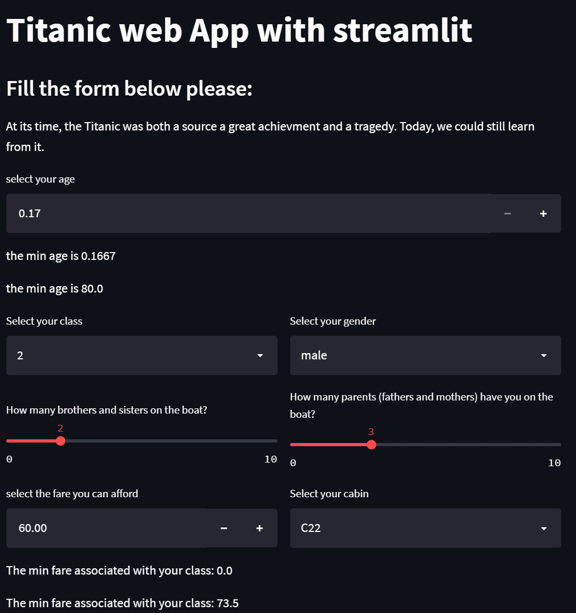

# titanic-streamlit-simapp
This repository is dedicated to a streamlit web App to predict the survival based on info provided by anyone.

This repository includes the following files:
* `titanic_app.py`: The main streamlit web application file
* `train_pipeline.py`: The main file to run the final pipeleine and create the the model binary file (in ./trained_model folder)
* `pipeline.py`: The python file the final transformation pipeline

The last 2 files won't be directly used in the web application and could be ignored but left for 2 main reasons:
1. These files will certainly be useful to re-train the model for future evolutions
2. The same folder structure could be completed and used to create a python module

You can refer to the project part of this repository to see how the project has been planned all along (since I used the KANBAN method available on Github).

The application (developped using Streamlit) is deployed on Heroku, and you can access it through the folowing link: https://titanic-streamlit-simap.herokuapp.com/

Below you can have a view of the web application.

Hope this can help you design your own application, but feel free to contact me if you need anaything.

Enjoy,
Regards
## Sébastien SIME | Data Scientist
