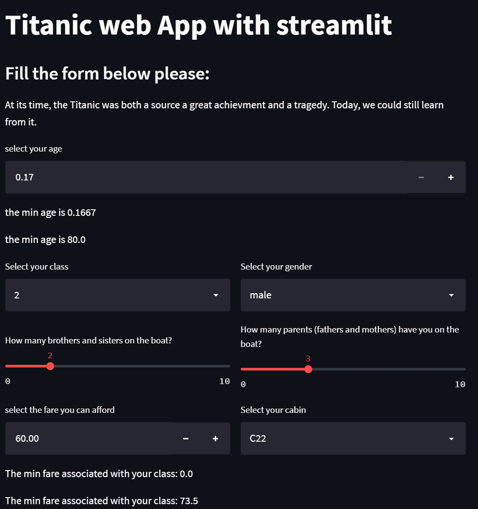

# titanic-streamlit-simapp
This repository is dedicated to a streamlit web App to predict the survival based on info provided by anyone.

The application (developped using Streamlit) is déployed on Heroku, and you can access it through the folowing link: https://titanic-streamlit-simap.herokuapp.com/

Below you can have a view of the web application.

This repository doesn't include the Research phase dedicated to build the prediction pipeline. The present repository is the result of this step though. You can refer to the project part of thsi repo to seee how the project has been planned all along (since I used the KANBAN method available on Github).

Hope this can help you design your own application, but feel free to contact me if you need anaything.
Regards
## Sébastien SIME | Data Scientist
